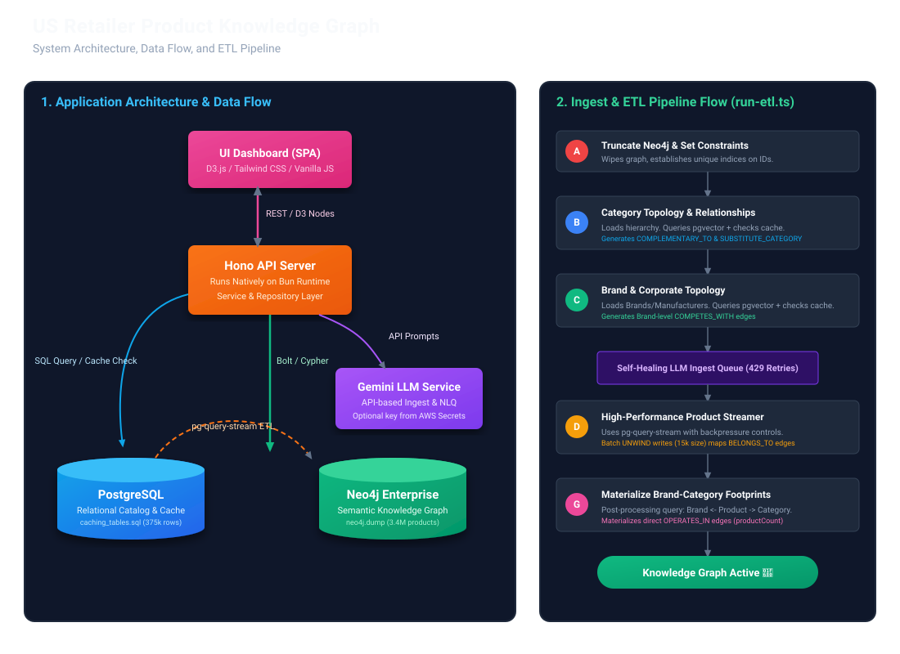
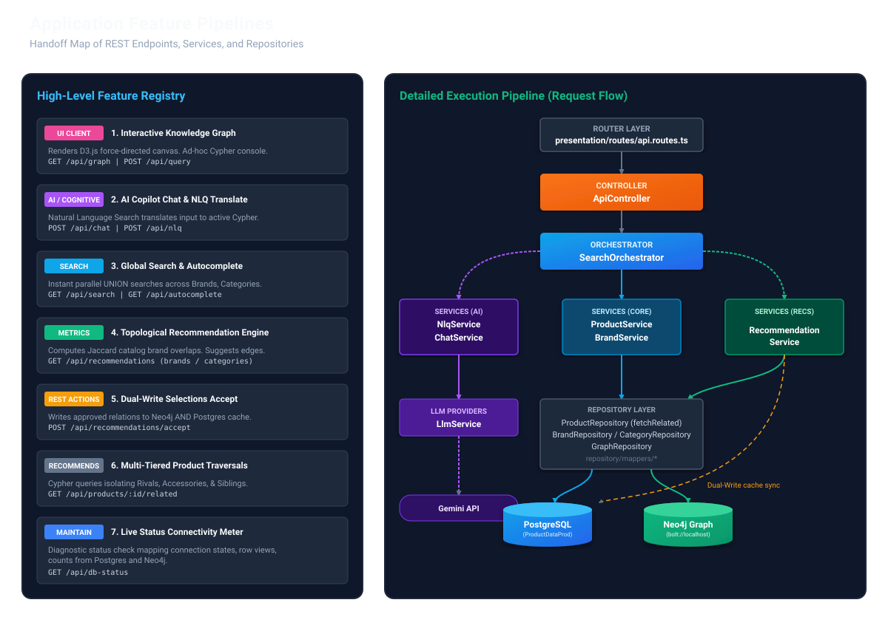
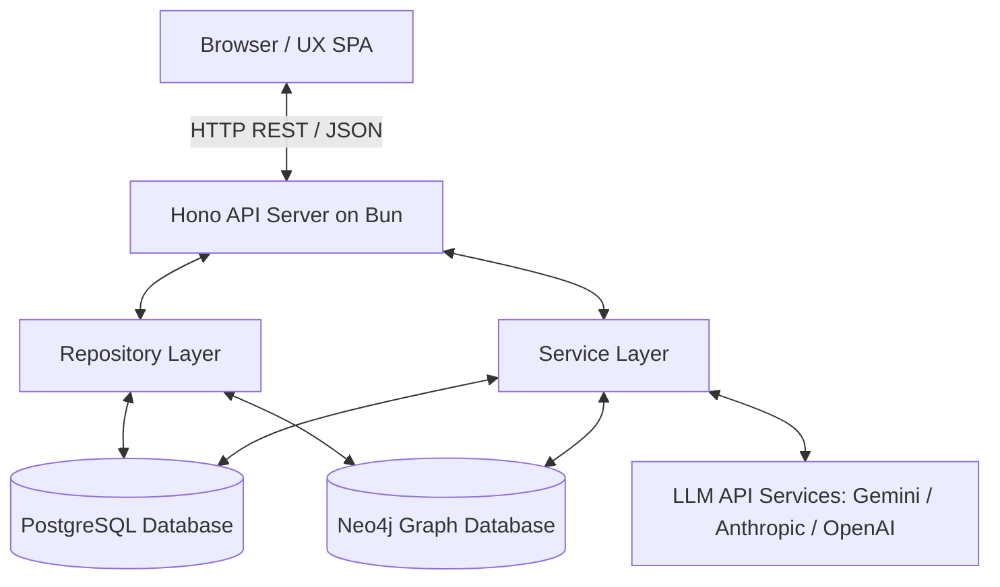
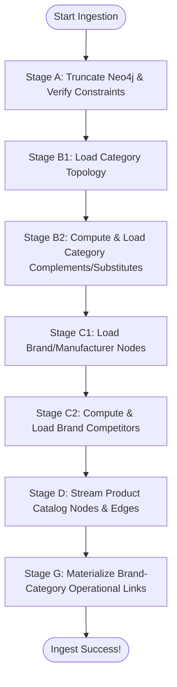

# US Retailer Product Knowledge Graph - Architecture Guide

This document provides a thorough overview of the system architecture, database design, ETL pipeline, service layer boundaries, and frontend UX design for the US Retailer Product Knowledge Graph. It serves as a ramp-up guide for engineers and agents (e.g., Claude Code) to build, troubleshoot, and enhance this application.




---

## 🏗️ High-Level System Architecture

The application is structured as a modern decoupled system:


---

## 💾 Database Architecture

The system uses a hybrid database approach combining a relational vector database (PostgreSQL + pgvector) and a native graph database (Neo4j).

### 1. PostgreSQL (Relational Catalog & Cache)
PostgreSQL acts as the system of record for product information, brand metadata, taxonomy tables, and embeddings.

* **Primary Catalog Tables**:
  - `global_products`: Source table containing product records, descriptions, prices, direct category IDs, and source details.
  - `brands` & `manufacturers`: Corporate hierarchy entities.
  - `product_categories`: Hierarchical category table mapping ID, parent ID, level, and category taxonomy.
  - `measure_synonym`: Normalization rules for item sizes and units of measure.
* **Materialized Views**: The application reads from optimized materialized views representing the active search surface:
  - `global_products_search_mv`
  - `brands_search_mv`
  - `product_categories_search_mv`
  - `brand_category_map_mv`
* **Caching Tables**:
  To prevent redundant, expensive LLM calls during ingestion and operations, the database maintains:
  - `category_relationships_cache`: Stores LLM-evaluated pairings of complementary and substitute categories.
  - `brand_competitor_judgments`: Stores LLM-evaluated brand competitor pairings.
  - `query_embedding_cache`: Caches generated vector embeddings for NLQ inputs.

---

### 2. Neo4j (Semantic Knowledge Graph)
Neo4j handles high-performance traversals, visual relationship mapping, NLQ translation target mapping, and topological recommendation logic.

#### Graph Schema (Nodes and Edges)
```mermaid
classDiagram
    class Product {
        +id: String
        +name: String
        +msrp: Float
        +itemSize: String
        +source: String
    }
    class Brand {
        +id: String
        +name: String
        +privateLabel: Boolean
        +source: String
    }
    class Manufacturer {
        +id: String
        +name: String
    }
    class Category {
        +id: String
        +name: String
        +taxonomy: String
        +level: Integer
    }

    Product --> Category : BELONGS_TO
    Product --> Manufacturer : MANUFACTURED_BY
    Product --> Brand : BRANDED_AS
    Brand --> Manufacturer : OWNED_BY
    Category --> Category : PARENT_CATEGORY
    Category --> Category : COMPLEMENTARY_TO (similarity: Float)
    Category --> Category : SUBSTITUTE_CATEGORY (similarity: Float)
    Brand --> Brand : COMPETES_WITH (similarity: Float)
```

* **Node Types**:
  - `(p:Product)`: Contains ID, name, MSRP, size, and source metadata.
  - `(b:Brand)`: Contains name, private label status, and source flag.
  - `(m:Manufacturer)`: Represents the corporate parent.
  - `(c:Category)`: Represents the retail taxonomy tree.
* **Relationship Types**:
  - `(p)-[:BELONGS_TO]->(c)`: Maps products to direct categories.
  - `(p)-[:MANUFACTURED_BY]->(m)`: Maps product to its physical manufacturer.
  - `(p)-[:BRANDED_AS]->(b)`: Maps product to its retailer label or brand.
  - `(b)-[:OWNED_BY]->(m)`: Corporate ownership edge.
  - `(c)-[:PARENT_CATEGORY]->(c_parent)`: Hierarchical category tree path.
  - `(c1)-[:COMPLEMENTARY_TO]->(c2)`: Bi-directional cross-shop relations with a semantic `similarity` score.
  - `(c1)-[:SUBSTITUTE_CATEGORY]->(c2)`: Bi-directional substitute relations with a semantic `similarity` score.
  - `(b1)-[:COMPETES_WITH]->(b2)`: Bi-directional competitor relations with a `similarity` score.

---

## ⚡ Ingest & ETL Pipeline

The ETL process (located in [etl.service.ts](service/etl.service.ts) and triggered by `utility-scripts/run-etl.ts`) populates the graph database from the PostgreSQL relational tables.



### Self-Healing LLM Queue Ingestion
During Stage B2 and Stage C2, the ETL pipeline evaluates semantic relationship candidates:
1. Candidate category and brand pairs are fetched using `pgvector` distance searches.
2. The pipeline checks `category_relationships_cache` or `brand_competitor_judgments` for existing values.
3. If uncached pairs are found, the pipeline routes them to the active LLM provider (e.g. Gemini) in batches of 50.
4. **Self-Healing Queue Monitor**: Handles rate limits (e.g., HTTP 429) by catching API errors, pausing for a cooldown period (e.g., 15 seconds), and re-queueing failed batches to ensure 100% processing completion.

### Backpressure-Aware Product Ingestion
To load hundreds of thousands of product nodes without running out of memory:
1. Product rows are fetched from PostgreSQL using `pg-query-stream`, which feeds rows through a Node readable stream.
2. Nodes are batched in memory (e.g., 15,000 products per block).
3. The pipeline writes to Neo4j using concurrent transactional writing session blocks (`UNWIND` Cypher statements), preventing socket starvation or buffer overflows.

### Stage G: Materializing Brand-Category Operational Links
After all products are successfully streamed and linked to their respective brands and categories, the pipeline executes a post-processing graph query to materialize direct relationships between Brands and Categories:
1. It queries paths matching `(b:Brand)<-[:MANUFACTURED_BY]-(p:Product)-[:BELONGS_TO]->(c:Category)`.
2. It aggregates product counts and materializes direct **`(:Brand)-[:OPERATES_IN]->(:Category)`** relationship edges in Neo4j, writing the aggregated volume onto the edge as a `productCount` property.
3. This direct operational edge is utilized by the search engine and recommendation system to query brand market footprints with sub-millisecond response times.

---

## ⚙️ Backend Architecture (Hono + Bun)

The backend is built with the Hono web framework running on the native Bun HTTP server for high throughput.

### Folder Structure
* `configs/`: Loads configuration settings, environment variables, active LLM choices, and table configurations ([app.config.ts](configs/app.config.ts)).
* `factory/`: Instantiates shared singletons, including the Postgres connection pool and Neo4j driver client ([database.factory.ts](factory/database.factory.ts)).
* `presentation/`:
  - `routes/`: Standard Hono endpoint routing maps ([api.routes.ts](presentation/routes/api.routes.ts)).
  - `controllers/`: Orchestrates incoming requests, calls services, and formats JSON responses ([api.controller.ts](presentation/controllers/api.controller.ts)).
* `repository/`: Contains data access classes executing raw SQL or Cypher:
  - `product.repository.ts`, `brand.repository.ts`, `category.repository.ts`, `graph.repository.ts`.
  - `mappers/`: Maps database records into clean DTO interfaces.
* `service/`:
  - `etl.service.ts`: Handles database initialization, indexing, constraint verification, streaming, and LLM relationship checks.
  - `llm.service.ts`: Abstraction layer supporting multi-provider fallback calls (Gemini, OpenAI, Anthropic).
  - `nlq.service.ts`: Processes Natural Language queries by mapping schema metadata to prompt guidelines, translating questions to Cypher, and running the query on Neo4j.
  - `chat.service.ts`: Feeds interactive copilot chat streams.
  - `recommendation.service.ts`: Core topological recommendation logic.
  - `orchestrator/`: decodes and coordinates multiple services (e.g., `SearchOrchestrator` formats autocomplete suggestions, searches, and D3 graph layouts).

---

## 🧬 Core Services & Features

This section details every operational feature in the system, its API endpoint, service implementation, and underlying logic.

### 1. Multi-Tiered Related Products Traversal
* **API Path**: `GET /api/products/:id/related`
* **Implementation**: [product.repository.ts](repository/product.repository.ts) (`fetchRelated()`)
* **Logic**: Rather than returning flat co-occurrence listings, the application uses a highly sophisticated single-hop/multi-hop Cypher traversal to partition related items into three distinct retail categories:
  1. **Rivals (Substitute Products)**:
     * *Query*: Finds products in the same category (or linked substitute categories via `[:SUBSTITUTE_CATEGORY]`) manufactured by competitor brands (defined by `[:COMPETES_WITH]`).
     * *Relevance*: Represents alternative purchases of competing brands in the same category aisle.
  2. **Companion Accessories (Complementary Products)**:
     * *Query*: Traverses from the active product's category to the parent department level, identifies complementary departments via `[:COMPLEMENTARY_TO]`, and retrieves products in those categories manufactured by the *same* brand.
     * *Relevance*: Provides brand-aligned cross-shopping companion ideas (e.g., matching smartphone chargers of the same brand).
  3. **Packaging/Flavor Siblings (Variations)**:
     * *Query*: Finds other products of the same brand in the exact same category.
     * *Relevance*: Displays package size variations, case counts, or alternative flavors of the same product.

---

### 2. Natural Language Query (NLQ) Translation Engine
* **API Path**: `POST /api/nlq`
* **Implementation**: [nlq.service.ts](service/nlq.service.ts) (`processNLQ()`)
* **Logic**:
  1. Receives natural language queries (e.g., *"Show me healthy snack substitutes"*).
  2. Resolves the vector embedding of the prompt (checking `query_embedding_cache` first).
  3. Formulates a prompt combining database schema boundaries, strict rules (such as naming all relationship variables to facilitate D3 rendering), and few-shot translation examples.
  4. Generates a valid Cypher query and executes it on Neo4j, returning D3-formatted nodes and edges.

---

### 3. Interactive AI Copilot Chat
* **API Path**: `POST /api/chat`
* **Implementation**: [chat.service.ts](service/chat.service.ts) (`processChatMessage()`)
* **Logic**:
  * Powers the slide-out conversational assistant.
  * Combines conversational history and schema knowledge to answer database design questions, write custom Cypher code, or explain the relationships shown on the graph dashboard.
  * Handles graceful fallbacks when offline (e.g., API key disabled/missing).

---

### 4. Topological Category & Brand Recommendations
* **API Paths**:
  * `GET /api/recommendations` (Category Complements & Substitutes)
  * `GET /api/recommendations/brands` (Brand Competitors)
* **Implementation**: [recommendation.service.ts](service/recommendation.service.ts)
* **Logic**:
  * Runs Neo4j graph co-occurrence and Jaccard similarity algorithms to suggest new relationships.
  * **Warmup & Concurrency Locks**: On server startup, the service runs in-memory warmup routines to load recommendations. Concurrent execution locks prevent duplicate requests from executing heavy scans simultaneously on Neo4j.
  * **LLM-as-a-Judge**: Candidates found via Jaccard overlaps are routed through the LLM to prune noise (e.g., matching two categories just because a large manufacturer owns both) and write custom, marketing-oriented rationales.

---

### 5. Dual-Write Approved Recommendations
* **API Paths**:
  * `POST /api/recommendations/accept` (Category relationship accept)
  * `POST /api/recommendations/brands/accept` (Brand competitor relationship accept)
* **Implementation**: [recommendation.service.ts](service/recommendation.service.ts)
* **Logic**:
  When an administrator approves a recommended connection on the dashboard:
  1. Writes the new edge (`[:COMPLEMENTARY_TO]`, `[:SUBSTITUTE_CATEGORY]`, or `[:COMPETES_WITH]`) directly into Neo4j.
  2. Simultaneously inserts the relationship record into the PostgreSQL database cache tables (`category_relationships_cache` or `brand_competitor_judgments`) to maintain cache-graph sync.
  3. Invalidates local service-layer cache records to force fresh evaluations.

---

### 6. Global Search & Autocomplete
* **API Paths**:
  * `GET /api/search?q=...`
  * `GET /api/autocomplete?q=...`
* **Implementation**: [product.repository.ts](repository/product.repository.ts)
* **Logic**:
  * **Autocomplete**: Runs a high-speed parallel `UNION` Cypher query matching input text against `Brand`, `Category`, and `Product` names with a limit of 8 per type. This returns typeahead suggestions instantaneously.
  * **Global Search**: Fetches matching entities and traverses their immediate neighbors to build a local sub-graph for display on the interactive D3 visual panel.

---

### 7. Real-Time Database Connection Status Meter
* **API Path**: `GET /api/db-status`
* **Implementation**: [api.controller.ts](presentation/controllers/api.controller.ts) (`getDbStatus()`)
* **Logic**:
  * Checks PostgreSQL pool connectivity and queries row counts in search views (`global_products_search_mv`, etc.).
  * Checks Neo4j driver connectivity and queries node counts for `Product`, `Brand`, and `Category`.
  * Monitors active LLM configurations and API key presences.
  * The UX polls this endpoint on startup to render status badges and counts.

---

## 🎨 Frontend Architecture

The client is a single-page application (SPA) located in the `ux/public/` directory:
* **`index.html`**: Visual layout featuring glassmorphism cards, sidebar controls, search panels, and the central Canvas workspace.
* **`styles.css`**: Styling containing layout animations, database health status rings, and dark mode variables.
* **`app.js`**: Core UI script handling state management:
  * **D3.js Force-Directed Graph**: Renders graph nodes (color-coded by type) and relationships. Hovering displays path tooltips.
  * **Interactive Copilot Chat**: Connects to the `/api/chat` route to display conversational answers alongside generated Cypher code blocks.
  * **Ad-hoc Cypher Terminal**: Allows developers to write and run custom Cypher queries directly against Neo4j, updating the visual canvas in real-time.
  * **Database Health Panel**: Displays connection status, row counts from Postgres views, and node counts from Neo4j.
  * **Review & Accept Recommendations Hub**: Displays predicted relations and rationales, enabling admins to accept and persist them with a single click.

---

## 🔧 Troubleshooting and Diagnostics

### Running Tests
* **Backend Unit & Integration Tests**:
  ```bash
  bun test tests/backend
  ```
* **E2E Visual Client Tests (Puppeteer)**:
  ```bash
  bun tests/ux/e2e-ui-test.ts
  ```

### Development Scripts
See the `./scratch/` folder for utility scripts to test specific services or query statuses, e.g.:
* `bun scratch/check-db-counts.ts`: Quick summary of counts in Postgres and Neo4j.
* `bun scratch/test-live-nlq.ts`: Exercises the NLQ query translation interface.
* `bun scratch/check-category-cache-status.ts`: Validates contents of the PostgreSQL cache.
